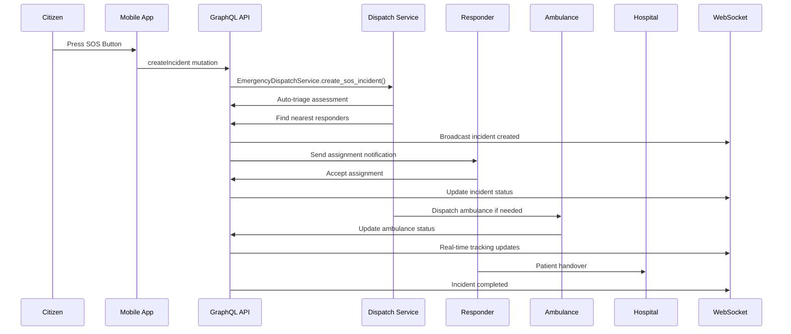
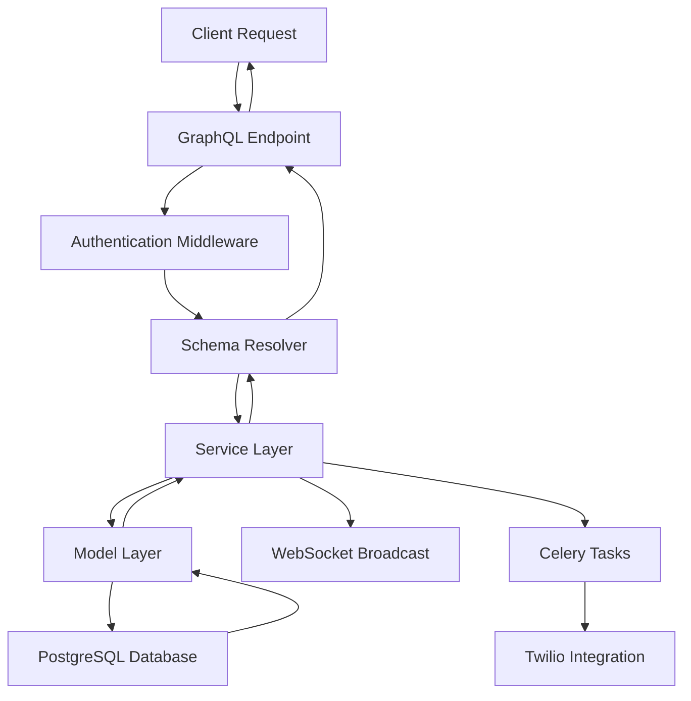
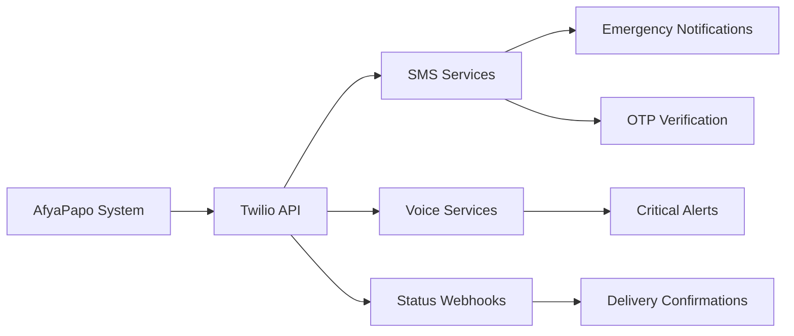

# AfyaPapo System Architecture

## Table of Contents

1. [System Overview](#system-overview)
2. [Technology Stack](#technology-stack)
3. [Architecture Patterns](#architecture-patterns)
4. [System Components](#system-components)
5. [Data Flow](#data-flow)
6. [Security Architecture](#security-architecture)
7. [Scalability & Performance](#scalability--performance)

## System Overview

AfyaPapo connects citizens to verified medical responders and ambulances through a real-time emergency response platform, optimized for Tanzania's diverse connectivity environments and healthcare infrastructure.

### Core Mission
- **Instant Emergency Response**: One-tap SOS with automatic responder assignment
- **Real-time Coordination**: Live tracking and communication between all stakeholders
- **Hospital Integration**: Seamless handover and resource management
- **Tanzania-Optimized**: Swahili/English support, mobile-first design, reliable communication

## Technology Stack

### Backend Framework
- **Django 5.2.5** - Web framework with ASGI support
- **Python 3.12+** - Programming language
- **PostgreSQL 16** - Primary database with PostGIS extensions
- **Redis 7** - Caching, sessions, and message broker

### API & Real-time Communication
- **Strawberry GraphQL** - Modern GraphQL implementation
- **Django Channels** - WebSocket support for real-time features
- **Uvicorn** - High-performance ASGI server

### Infrastructure
- **Docker** - Containerization with multi-stage builds
- **Celery** - Background task processing
- **Nginx** - Reverse proxy and load balancer (production)

### External Services
- **Twilio** - SMS, voice calls, and communication services
- **Firebase/APNs** - Push notifications
- **OpenStreetMap** - Mapping services

## Architecture Patterns

### 1. Domain-Driven Design (DDD)
The system is organized into 8 domain-specific Django applications:

```
afya_papo/
├── users/          # User management & authentication
├── hospitals/      # Medical facility management  
├── incidents/      # Emergency incident tracking
├── responders/     # Medical responder system
├── ambulances/     # Ambulance fleet management
├── assignments/    # Task & resource coordination
├── communications/ # Multi-channel messaging
└── geospatial/     # Location services & mapping
```

### 2. Clean Architecture
- **Domain Layer**: Models and business logic
- **Application Layer**: Services and use cases
- **Infrastructure Layer**: External integrations
- **Presentation Layer**: GraphQL schema and WebSocket consumers

### 3. Event-Driven Architecture
- **Django Signals**: For cross-domain communication
- **Celery Tasks**: For asynchronous processing
- **WebSocket Events**: For real-time updates

## System Components

### Core Backend (`afyaPapo_core/`)
Central configuration and shared components:

```python
# Key Components
├── settings.py     # Django configuration
├── urls.py         # URL routing
├── schema.py       # GraphQL schema (1000+ lines)
├── auth.py         # JWT authentication system
├── middleware.py   # Custom middleware
├── routing.py      # WebSocket routing
└── asgi.py         # ASGI application
```

**Key Features:**
- Environment-based configuration
- JWT authentication with refresh tokens
- Rate limiting and security middleware
- GraphQL schema with 35+ types
- WebSocket routing for real-time features

### Domain Applications

#### Emergency Response Flow


#### Data Flow Architecture


## Security Architecture

### Authentication & Authorization
- **JWT Tokens**: Access (15min), Refresh (7 days), Verification (24h)
- **Phone OTP Verification**: Tanzania mobile-first approach
- **Role-Based Access Control**: Citizen, Responder, Admin, Dispatcher
- **Session Management**: Secure session tracking with device info

### Data Protection
- **Encryption at Rest**: AES-256 for sensitive medical data
- **TLS 1.2+**: All communications encrypted in transit
- **PII Protection**: Phone numbers and medical data properly secured
- **Audit Logging**: Comprehensive security event tracking

### API Security
- **Rate Limiting**: IP-based request throttling
- **CORS Configuration**: Strict origin validation
- **CSRF Protection**: Token-based CSRF prevention
- **Input Validation**: Comprehensive data sanitization

## Scalability & Performance

### Database Optimization
- **Indexed Queries**: Strategic indexes on frequently queried fields
- **Spatial Indexes**: PostGIS optimization for location queries
- **Connection Pooling**: Efficient database connection management
- **Read Replicas**: Separate read/write database instances

### Caching Strategy
- **Redis Caching**: Session data, frequently accessed data
- **Query Optimization**: Database query optimization
- **CDN Integration**: Static asset delivery
- **Browser Caching**: Appropriate cache headers

### Real-time Performance
- **WebSocket Connection Pooling**: Efficient connection management
- **Message Broadcasting**: Optimized group messaging
- **Background Tasks**: Celery for heavy operations
- **Load Balancing**: Horizontal scaling support

### Monitoring & Observability
- **Structured Logging**: Comprehensive system logging
- **Performance Metrics**: Response time and throughput monitoring
- **Health Checks**: System health monitoring
- **Error Tracking**: Comprehensive error reporting

## Deployment Architecture

### Production Environment
```
Internet
    ↓
Load Balancer (Nginx)
    ↓
Django/Uvicorn (Multiple Instances)
    ↓
PostgreSQL (Primary + Replicas)
Redis Cluster
Celery Workers
```

### Container Strategy
- **Multi-stage Docker builds** for optimized images
- **Docker Compose** for development environment
- **Kubernetes** ready for production orchestration
- **Health checks** for container orchestration

### External Service Integration

#### Twilio Integration Architecture


## Service Dependencies

### Core Dependencies
```yaml
Production Services:
  - PostgreSQL 16 with PostGIS
  - Redis 7 with persistence
  - Twilio API (SMS/Voice)
  - Firebase/APNs (Push notifications)

Development Dependencies:
  - Docker Desktop
  - Python 3.12+
  - Node.js 18+ (for client development)
```

### High Availability Setup
```yaml
Database:
  - Primary PostgreSQL instance
  - 2x Read replicas
  - Automated failover
  
Cache:
  - Redis cluster (3 nodes)
  - Sentinel for high availability
  
Application:
  - 3x Django instances (minimum)
  - Load balancer health checks
  - Auto-scaling based on CPU/memory
```

This architecture provides a robust, scalable foundation for Tanzania's emergency response system with real-time capabilities, comprehensive security, and optimized performance for critical healthcare scenarios.