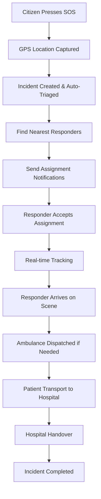

# AfyaPapo Emergency Response System Documentation

**AfyaPapo** ("Huduma Ya Haraka, Popote Ulipo" - Quick Service, Wherever You Are) is a comprehensive emergency response system designed for Tanzania's healthcare infrastructure.

## 📚 Documentation Index

1. **[System Architecture](./ARCHITECTURE.md)** - Complete system overview, technology stack, and architectural patterns
2. **[Domain Applications](./DOMAIN_APPS.md)** - Detailed documentation of all 8 Django apps
3. **[GraphQL API](./GRAPHQL_API.md)** - Complete API documentation with examples
4. **[Mobile Client Integration](./MOBILE_CLIENT.md)** - Guide for mobile app development
5. **[Hospital Web Client](./HOSPITAL_CLIENT.md)** - Guide for hospital web dashboard
6. **[Authentication & Security](./AUTH_SECURITY.md)** - Security implementation guide
7. **[Deployment Guide](./DEPLOYMENT.md)** - Production deployment instructions

## 🎯 Quick Start

### For Developers
- Start with [System Architecture](./ARCHITECTURE.md) for overview
- Review [Domain Applications](./DOMAIN_APPS.md) for business logic
- Use [GraphQL API](./GRAPHQL_API.md) for API integration

### For Mobile Developers
- Read [Mobile Client Integration](./MOBILE_CLIENT.md)
- Review [Authentication & Security](./AUTH_SECURITY.md)
- Check [GraphQL API](./GRAPHQL_API.md) for available endpoints

### For Hospital IT Teams
- Start with [Hospital Web Client](./HOSPITAL_CLIENT.md)
- Review [Authentication & Security](./AUTH_SECURITY.md)
- Check [Deployment Guide](./DEPLOYMENT.md) for setup

### For DevOps Teams
- Begin with [Deployment Guide](./DEPLOYMENT.md)
- Review [System Architecture](./ARCHITECTURE.md)
- Check [Authentication & Security](./AUTH_SECURITY.md)

## 🚨 Emergency Response Flow

## 🛠️ Technology Stack

- **Backend**: Django 5.2.5 with ASGI support
- **API**: Strawberry GraphQL with real-time subscriptions
- **Database**: PostgreSQL 16 with PostGIS extensions
- **Real-time**: Django Channels with Redis
- **External Services**: Twilio (SMS, Voice), Firebase/APNs (Push Notifications)
- **Infrastructure**: Docker, Nginx, Celery

## 🌍 Tanzania-Specific Features

- **Multi-language Support**: English and Swahili
- **Phone-based Authentication**: Primary authentication via phone numbers
- **Regional Integration**: Tanzania's administrative regions and districts
- **Healthcare Integration**: Tanzania Medical Council verification
- **Communication**: Twilio integration for reliable SMS/voice services

## 🔗 External Integrations

### Twilio Services
- **SMS**: Emergency notifications and OTP verification
- **Voice Calls**: Critical emergency alerts
- **Status Webhooks**: Delivery confirmations

### Mobile Services  
- **Firebase**: Push notifications for Android
- **APNs**: Push notifications for iOS
- **GPS Services**: Real-time location tracking

### Geospatial Services
- **OpenStreetMap**: Mapping and routing
- **PostGIS**: Spatial database queries
- **Location Services**: Proximity-based assignment

## 📊 System Metrics

- **Response Time Target**: < 15 minutes for critical emergencies
- **Concurrent Users**: Supports 10,000+ simultaneous users
- **Real-time Updates**: Sub-second WebSocket message delivery
- **Geographic Coverage**: All 31 regions of Tanzania
- **Scalability**: Horizontal scaling with Docker containers

## 🏥 Supported Facility Types

- **Hospitals**: Level 1-4 hospitals with full emergency capabilities
- **Health Centers**: Regional health centers with basic emergency care
- **Dispensaries**: Community dispensaries for minor emergencies
- **Specialized Clinics**: Maternal health, cardiac care, trauma centers

## 📱 Supported Platforms

### Mobile Applications
- **iOS**: Native app with offline capabilities
- **Android**: Native app with background location services
- **Progressive Web App**: For areas with limited app store access

### Web Applications
- **Hospital Dashboard**: Real-time facility management
- **Admin Panel**: System administration and analytics
- **Public Portal**: Incident status and facility information

## 🔒 Security & Compliance

- **Healthcare Data Protection**: GDPR and healthcare privacy compliance
- **End-to-end Encryption**: All sensitive medical data encrypted
- **Audit Trails**: Complete logging of all emergency activities
- **Role-based Access**: Granular permissions for different user types

## 📞 Support & Contact

For technical support or questions about the AfyaPapo system:

- **Development Team**: technical@afyapapo.org
- **Emergency Operations**: operations@afyapapo.org  
- **System Administration**: admin@afyapapo.org

---

*This documentation is maintained by the AfyaPapo development team for the PT Software Development Hackathon 2025.*